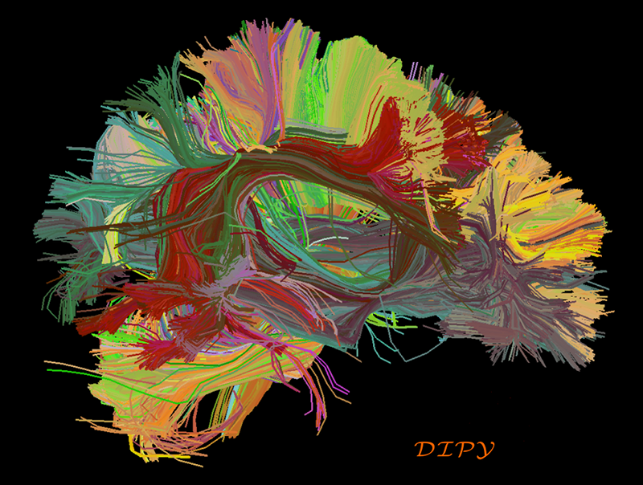
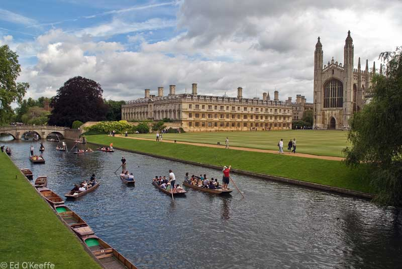
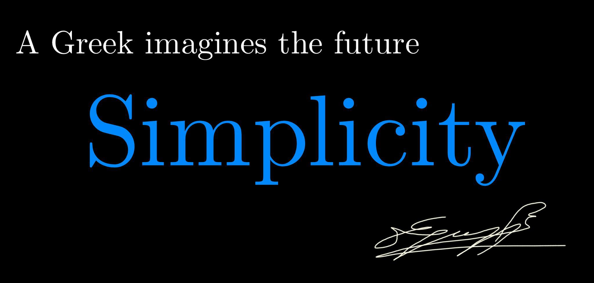

======================================
|Dr| Eleftherios Garyfallidis, PhD
======================================

.. raw:: html
        
        <H2 align="center"> 
        I create tools to navigate non-invasively the information super-highways of the human brain. 
        </H1>

.. Science
.. ==========

.. Education
.. ===========

.. Personal
.. ========

.. image:: figures/eleftherios_alps.jpg
    :align: center
    :width: 800px
    :target: http://www.facebook.com/garyfallidis

.. Philosophy
.. ==========

.. Publications
.. ============

